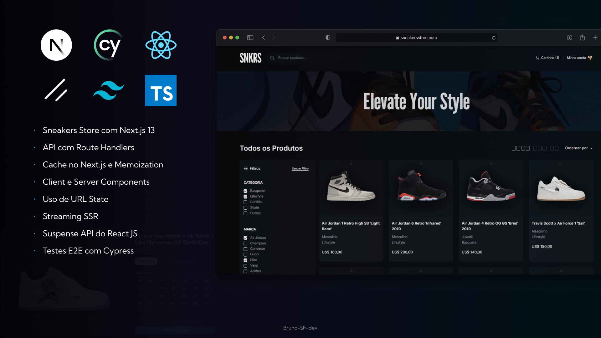

## Sobre

O projeto SNKRS é uma sneaker store. Foi construído a fim de colocar em prática os avanços mais recentes no Next.js 13.

##### Conceitos Utilizados do Next.js 13 e dos recursos do React para Sever Components

- Rotas de API com as novas Route Handlers.
- Cache no Next, gerenciado através do uso da Fetch API que é estendida pelo Next.
- Aproveito dos recursos dos novos Server Components e dos Client Components.
- Uso de URL State para gerenciar os parâmetros e queries de requição.
- Streaming SSR do Next, que entrega as páginas e componentes de forma parcial durante uma requisição.
- Uso da Suspense API do React, a fim de tratar seções de loading por componente.

Nele, inclui os seguintes recursos:

- Listagens abrangentes de sneakers.
- Paginação para facilitar a navegação.
- Opções avançadas de filtragem por categoria, marca, gênero e cor.
- Funcionalidade de ordenação.
- Páginas de produtos detalhadas para visualização aprimorada.
- Funcionalidade de adicionar produtos ao carrinho.
- Skeletons Screens para componentes que estão buscando dados.

## Tecnologias

- [**React JS**](https://pt-br.legacy.reactjs.org/) | [**Next.js**](https://nextjs.org/) | [**Typescript**](https://www.typescriptlang.org/)

- [**Tailwind CSS**](https://tailwindcss.com/): O Tailwind CSS foi empregado para estilizar a aplicação de forma rápida e consistente, utilizando classes utilitárias.

- [**Cypress**](https://docs.cypress.io/): Ferramenta implementada para realizar testes de integração E2E, garantindo a qualidade e confiabilidade do código. Focado na simulação de interações do usuário em um ambiente de teste realista.
